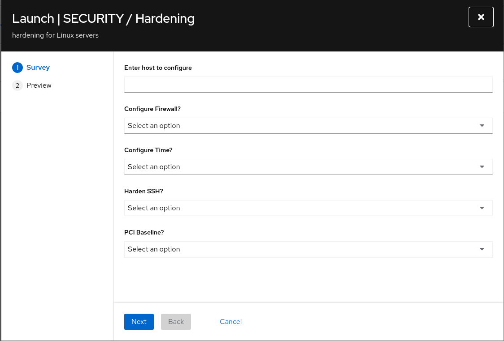

# Workshop Exercise - System Roles (Controller-driven)

**Read this in other languages**:
<br> [English](README.md)
<br>

## Table of Contents

- [Workshop Exercise - System Roles (Controller-driven)](#workshop-exercise---system-roles-controller-driven)
  - [Objective](#objective)
  - [Guide](#guide)
    - [Step 1 - Examine the project](#step-1---examine-the-project)
    - [Step 2 - Review the playbook](#step-2---review-the-playbook)
    - [Step 3 - About Linux and RHEL System Roles](#step-3---about-linux-and-rhel-system-roles)
    - [Step 4 - Create and launch the Job Template with a Survey](#step-4---create-and-launch-the-job-template-with-a-survey)
    - [Step 5 - Verify configuration](#step-5---verify-configuration)
  - [Complete](#complete)

## Objective

Use pre-existing content (roles and collections) from Automation Hub and Ansible Galaxy to configure hosts via Ansible Automation Controller, leveraging Linux System Roles and RHEL System Roles with a simple Survey-driven job.

You will:
- Use firewall and timesync system roles
- Create a Job Template in Controller
- Add a Survey to toggle role behavior
- Launch and verify

## Guide

### Step 1 - Examine the project

In the Ansible Automation Controller UI navigate to Projects and open the preloaded repository:


Repository (preloaded):
- https://github.com/ansible/product-demos

### Step 2 - Review the playbook

Open the repository in your browser and navigate to:
- linux/hardening.yml
  - https://github.com/ansible/product-demos/blob/main/linux/hardening.yml

Relevant tasks (roles are conditionally included):

```yaml
- name: Configure Firewall
  when: harden_firewall | bool
  ansible.builtin.include_role:
    name: linux-system-roles.firewall

- name: Configure Timesync
  when: harden_time | bool
  ansible.builtin.include_role:
    name: redhat.rhel_system_roles.timesync
```

Role naming tips:
- Collection role: namespace.collection.role (e.g., redhat.rhel_system_roles.timesync)
- Standalone role: namespace.role (e.g., linux-system-roles.firewall)

### Step 3 - About Linux and RHEL System Roles

System Roles provide consistent interfaces for subsystem configuration, abstracting implementation differences.

Examples:
- firewall (linux-system-roles.firewall)
  - Controls services such as http/https and more
  - Example var:
    ```yaml
    vars:
      firewall:
        service: 'http'
        state: 'enabled'
    ```
- timesync (redhat.rhel_system_roles.timesync)
  - Manages chrony or ntp as appropriate
  - Example var:
    ```yaml
    vars:
      timesync_ntp_servers:
        - hostname: pool.ntp.org
          iburst: yes
    ```

### Step 4 - Create and launch the Job Template with a Survey

1) In Controller, go to Automation Execution → Templates and click Create template → Create job template.

Template fields:

<table>
  <tr><th>Parameter</th><th>Value</th></tr>
  <tr><td>Name</td><td>SERVER / Hardening</td></tr>
  <tr><td>Job Type</td><td>Run</td></tr>
  <tr><td>Inventory</td><td>Workshop Inventory</td></tr>
  <tr><td>Project</td><td>Ansible official demo project</td></tr>
  <tr><td>Playbook</td><td><code>linux/hardening.yml</code></td></tr>
  <tr><td>Execution Environment</td><td>Default execution environment</td></tr>
  <tr><td>Credentials</td><td>Workshop Credential</td></tr>
</table>


2) Add a Survey to toggle roles:
- Survey Questions:
  - CONFIGURE FIREWALL? (boolean) → sets harden_firewall
  - CONFIGURE TIME? (boolean) → sets harden_time



Click Launch:


If a confirmation step is shown:


Review the EXTRA VARIABLES to see how the survey sets the role switches and proceed.

### Step 5 - Verify configuration

From the control node, verify time configuration:

```bash
ssh node1
sudo systemctl status chronyd.service
timedatectl
```

Example commands:
```bash
chronyc tracking
chronyc sources
chronyc sourcestats
chronyc activity
```

## Complete

You have completed System Roles using Controller with a Survey-driven job.

---
**Navigation**
<br>
[Previous Exercise](../2.7-wrap) - [Next: Bonus - RHEL Image Mode](../supplemental/image-mode)

[Click here to return to the Ansible for Red Hat Enterprise Linux Workshop](../README.md)


